<!-- Neon terminal profile. The SVGs in assets/ are regenerated daily by .github/workflows/profile-svgs.yml -->

  

  

  
  
  
  
  
  
  

  

  

  

  <a href="https://linkedin.com/in/himanshu-gupta27"><code>◉ LINKEDIN</code></a>&nbsp;&nbsp;
  <a href="https://portfoliohimanshugupta.netlify.app"><code>◉ PORTFOLIO</code></a>&nbsp;&nbsp;
  <a href="https://leetcode.com/u/himanshu8083/"><code>◉ LEETCODE</code></a>&nbsp;&nbsp;
  <a href="https://www.codechef.com/users/himanshugpt80"><code>◉ CODECHEF</code></a>&nbsp;&nbsp;
  <a href="mailto:himanshugpt0005@gmail.com"><code>✉ EMAIL</code></a>

<code>himanshu@github:~$ exit_</code>

